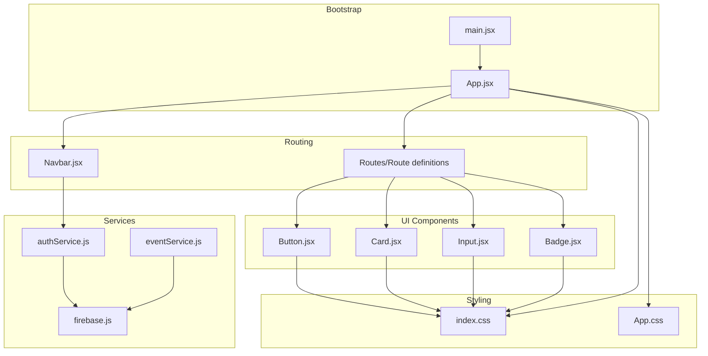
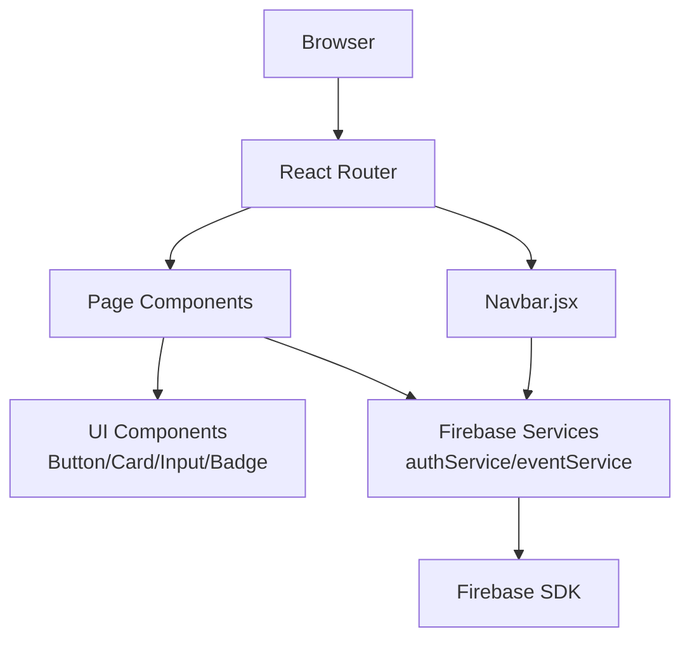
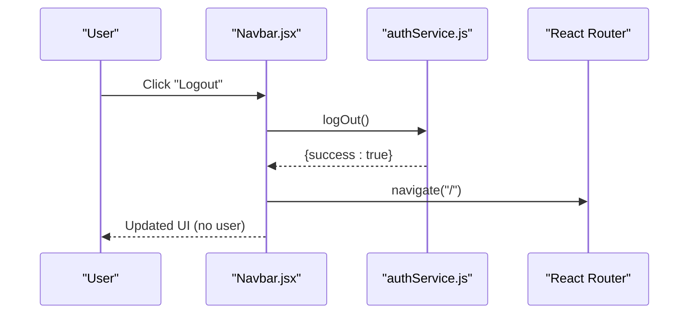
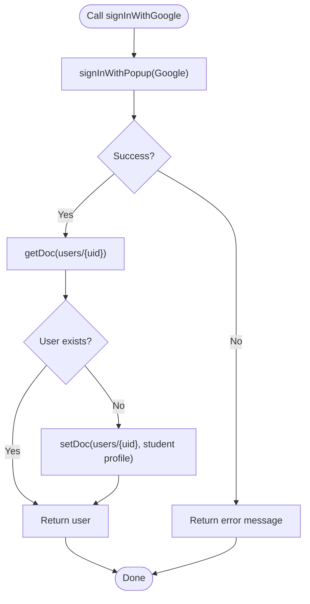
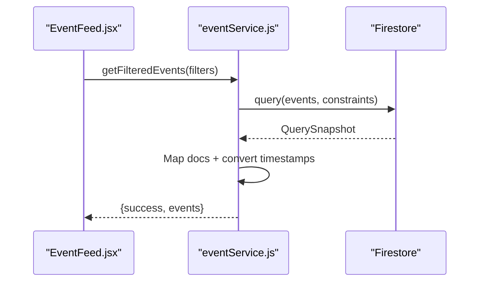
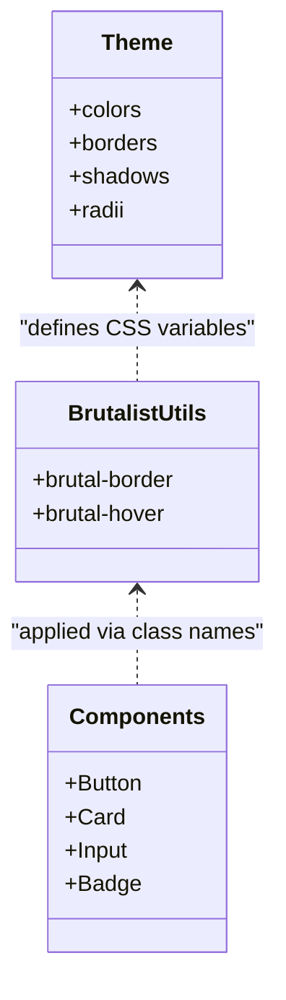
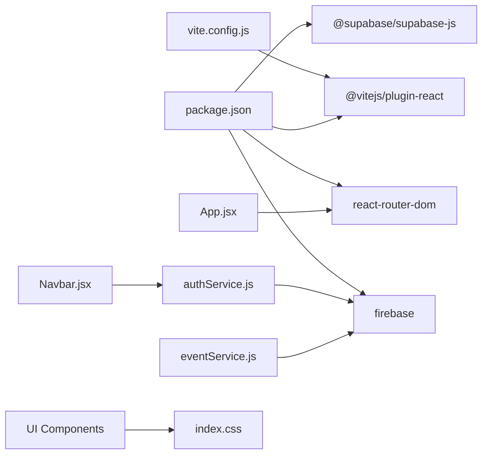

# Frontend Architecture

<cite>
**Referenced Files in This Document**
- [main.jsx](file://frontend/src/main.jsx)
- [App.jsx](file://frontend/src/App.jsx)
- [Navbar.jsx](file://frontend/src/components/Navbar.jsx)
- [Button.jsx](file://frontend/src/components/ui/Button.jsx)
- [Card.jsx](file://frontend/src/components/ui/Card.jsx)
- [Input.jsx](file://frontend/src/components/ui/Input.jsx)
- [Badge.jsx](file://frontend/src/components/ui/Badge.jsx)
- [firebase.js](file://frontend/src/firebase.js)
- [authService.js](file://frontend/src/services/authService.js)
- [eventService.js](file://frontend/src/services/eventService.js)
- [index.css](file://frontend/src/index.css)
- [App.css](file://frontend/src/App.css)
- [vite.config.js](file://frontend/vite.config.js)
- [package.json](file://frontend/package.json)
</cite>

## Table of Contents
1. [Introduction](#introduction)
2. [Project Structure](#project-structure)
3. [Core Components](#core-components)
4. [Architecture Overview](#architecture-overview)
5. [Detailed Component Analysis](#detailed-component-analysis)
6. [Dependency Analysis](#dependency-analysis)
7. [Performance Considerations](#performance-considerations)
8. [Troubleshooting Guide](#troubleshooting-guide)
9. [Conclusion](#conclusion)

## Introduction
This document describes the frontend architecture of the Mela application built with React 19 and Vite. It explains the component hierarchy, design system rooted in Brutalist aesthetics using Vanilla CSS, routing configuration, reusable UI components, state management strategies, and integration with Firebase services. The goal is to provide a clear understanding of how different parts of the frontend communicate and how developers can extend or maintain the system effectively.

## Project Structure
The frontend is organized into clear layers:
- Application bootstrap and routing live in the root source folder.
- Reusable UI components are grouped under a dedicated UI module.
- Page components are organized by feature routes.
- Services encapsulate Firebase interactions and business logic.
- Styling leverages a centralized design system with Brutalist-inspired CSS utilities.

**Diagram sources**
- [main.jsx:1-11](file://frontend/src/main.jsx#L1-L11)
- [App.jsx:14-31](file://frontend/src/App.jsx#L14-L31)
- [Navbar.jsx:1-98](file://frontend/src/components/Navbar.jsx#L1-L98)
- [Button.jsx:1-12](file://frontend/src/components/ui/Button.jsx#L1-L12)
- [Card.jsx:1-9](file://frontend/src/components/ui/Card.jsx#L1-L9)
- [Input.jsx:1-18](file://frontend/src/components/ui/Input.jsx#L1-L18)
- [Badge.jsx:1-12](file://frontend/src/components/ui/Badge.jsx#L1-L12)
- [authService.js:1-134](file://frontend/src/services/authService.js#L1-L134)
- [eventService.js:1-229](file://frontend/src/services/eventService.js#L1-L229)
- [firebase.js:1-28](file://frontend/src/firebase.js#L1-L28)
- [index.css:1-254](file://frontend/src/index.css#L1-L254)
- [App.css:1-185](file://frontend/src/App.css#L1-L185)

**Section sources**
- [main.jsx:1-11](file://frontend/src/main.jsx#L1-L11)
- [App.jsx:14-31](file://frontend/src/App.jsx#L14-L31)
- [vite.config.js:1-8](file://frontend/vite.config.js#L1-L8)
- [package.json:1-30](file://frontend/package.json#L1-L30)

## Core Components
This section documents the reusable UI components and their roles in the design system.

- Button
  - Purpose: Standardized interactive elements with variant support and Brutalist styling.
  - Props: children, variant, className, and spread props passed to the native button.
  - Styling: Uses shared Brutalist classes and variant-specific background colors.
  - Composition: Used extensively in navigation and forms.

- Card
  - Purpose: Container component for event listings and content blocks.
  - Props: children, className.
  - Styling: Inherits Brutalist borders, shadows, and hover transforms.

- Input
  - Purpose: Flexible form input supporting text, textarea, and select variants.
  - Props: label, type, options, and spread props to underlying elements.
  - Styling: Shared input-group layout and Brutalist input styling.

- Badge
  - Purpose: Lightweight status or category indicators.
  - Props: children, color (defaulting to a brand teal).
  - Styling: Brutalist border and shadow with dynamic background color.

**Section sources**
- [Button.jsx:1-12](file://frontend/src/components/ui/Button.jsx#L1-L12)
- [Card.jsx:1-9](file://frontend/src/components/ui/Card.jsx#L1-L9)
- [Input.jsx:1-18](file://frontend/src/components/ui/Input.jsx#L1-L18)
- [Badge.jsx:1-12](file://frontend/src/components/ui/Badge.jsx#L1-L12)
- [index.css:36-254](file://frontend/src/index.css#L36-L254)

## Architecture Overview
The application follows a layered architecture:
- Presentation Layer: React components (App, Navbar, Pages) render UI and orchestrate user interactions.
- Routing Layer: React Router manages route definitions and navigations.
- Service Layer: Firebase-backed services encapsulate data retrieval and mutations.
- Design System: Centralized CSS defines Brutalist styles and reusable utilities.

**Diagram sources**
- [App.jsx:14-31](file://frontend/src/App.jsx#L14-L31)
- [Navbar.jsx:1-98](file://frontend/src/components/Navbar.jsx#L1-L98)
- [authService.js:1-134](file://frontend/src/services/authService.js#L1-L134)
- [eventService.js:1-229](file://frontend/src/services/eventService.js#L1-L229)
- [firebase.js:1-28](file://frontend/src/firebase.js#L1-L28)

## Detailed Component Analysis

### Routing and Navigation
- App sets up BrowserRouter, Navbar, and route definitions for all major pages.
- Navbar handles authentication state via onAuthChange, displays conditional links, and provides logout flow.
- Navigation uses Link for client-side navigation and Button for interactive actions.

**Diagram sources**
- [Navbar.jsx:18-22](file://frontend/src/components/Navbar.jsx#L18-L22)
- [authService.js:92-100](file://frontend/src/services/authService.js#L92-L100)
- [App.jsx:18-28](file://frontend/src/App.jsx#L18-L28)

**Section sources**
- [App.jsx:14-31](file://frontend/src/App.jsx#L14-L31)
- [Navbar.jsx:1-98](file://frontend/src/components/Navbar.jsx#L1-L98)

### Authentication Service
- Provides sign-up, sign-in, Google sign-in, logout, and auth state subscription.
- Creates user profiles in Firestore upon registration or first Google sign-in.
- Exposes helpers to fetch current user and profile.

**Diagram sources**
- [authService.js:59-87](file://frontend/src/services/authService.js#L59-L87)
- [authService.js:119-133](file://frontend/src/services/authService.js#L119-L133)

**Section sources**
- [authService.js:1-134](file://frontend/src/services/authService.js#L1-L134)

### Event Service
- Implements queries for events by university, category, upcoming, and filtered lists.
- Supports search across title and description.
- Converts Firestore timestamps to JavaScript Date objects.

**Diagram sources**
- [eventService.js:132-167](file://frontend/src/services/eventService.js#L132-L167)
- [eventService.js:172-191](file://frontend/src/services/eventService.js#L172-L191)

**Section sources**
- [eventService.js:1-229](file://frontend/src/services/eventService.js#L1-L229)

### Design System and Styling
- Central theme variables define brand colors, borders, shadows, and radii.
- Reusable Brutalist classes (.brutal-border, .brutal-hover) unify component styling.
- Component-specific styles (buttons, inputs, cards, badges) leverage the design tokens.
- Layout utilities (container, flex-between, grid-3) support responsive layouts.

**Diagram sources**
- [index.css:3-21](file://frontend/src/index.css#L3-L21)
- [index.css:36-52](file://frontend/src/index.css#L36-L52)
- [index.css:111-163](file://frontend/src/index.css#L111-L163)

**Section sources**
- [index.css:1-254](file://frontend/src/index.css#L1-L254)
- [App.css:1-185](file://frontend/src/App.css#L1-L185)

## Dependency Analysis
- Build tooling: Vite with React plugin.
- Runtime dependencies: React, React Router DOM, Firebase, Supabase.
- Internal dependencies: UI components depend on shared CSS; services depend on Firebase SDK; pages consume services and UI components.

**Diagram sources**
- [vite.config.js:1-8](file://frontend/vite.config.js#L1-L8)
- [package.json:12-18](file://frontend/package.json#L12-L18)
- [App.jsx:2-12](file://frontend/src/App.jsx#L2-L12)
- [Navbar.jsx:3](file://frontend/src/components/Navbar.jsx#L3)
- [authService.js:11](file://frontend/src/services/authService.js#L11)
- [eventService.js:14](file://frontend/src/services/eventService.js#L14)
- [index.css:1-254](file://frontend/src/index.css#L1-L254)

**Section sources**
- [vite.config.js:1-8](file://frontend/vite.config.js#L1-L8)
- [package.json:1-30](file://frontend/package.json#L1-L30)

## Performance Considerations
- Prefer lightweight UI components and avoid unnecessary re-renders by passing memoized props.
- Use Firestore queries efficiently; consider pagination or indexing for large datasets.
- Keep CSS scoped and avoid deep nesting to minimize cascade costs.
- Lazy-load heavy pages or images to improve initial load performance.

## Troubleshooting Guide
- Authentication state not updating:
  - Verify onAuthChange subscription lifecycle and ensure cleanup in Navbar.
  - Confirm Firebase auth initialization and provider setup.
- Firestore errors:
  - Check service method error handling and returned error messages.
  - Validate Firestore rules and indexes for queries.
- Styling inconsistencies:
  - Ensure Brutalist utility classes are applied consistently.
  - Confirm CSS variable definitions and media queries.

**Section sources**
- [Navbar.jsx:11-16](file://frontend/src/components/Navbar.jsx#L11-L16)
- [authService.js:105-107](file://frontend/src/services/authService.js#L105-L107)
- [eventService.js:35-38](file://frontend/src/services/eventService.js#L35-L38)
- [index.css:3-21](file://frontend/src/index.css#L3-L21)

## Conclusion
Mela’s frontend employs a clean, modular structure with a strong emphasis on a Brutalist design system implemented through Vanilla CSS. The React 19 application integrates Firebase for authentication and data operations, while services encapsulate business logic and keep components focused on rendering. The routing layer, centered around React Router, enables straightforward navigation across feature pages. This architecture supports scalability, maintainability, and a consistent user experience aligned with the project’s aesthetic goals.