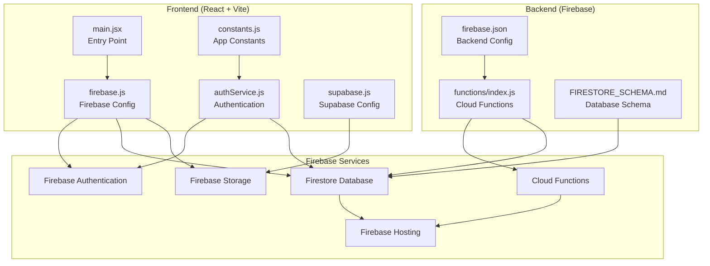
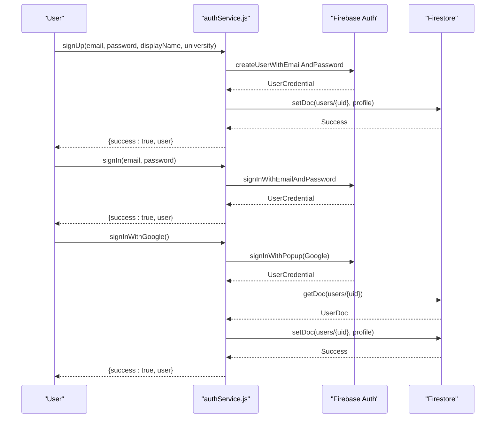

# Getting Started

<cite>
**Referenced Files in This Document**
- [README.md](file://README.md)
- [QUICKSTART.md](file://QUICKSTART.md)
- [backend/README.md](file://backend/README.md)
- [frontend/package.json](file://frontend/package.json)
- [backend/package.json](file://backend/package.json)
- [frontend/vite.config.js](file://frontend/vite.config.js)
- [backend/functions/package.json](file://backend/functions/package.json)
- [frontend/src/firebase.js](file://frontend/src/firebase.js)
- [backend/firebase.json](file://backend/firebase.json)
- [backend/functions/index.js](file://backend/functions/index.js)
- [backend/FIRESTORE_SCHEMA.md](file://backend/FIRESTORE_SCHEMA.md)
- [frontend/src/services/authService.js](file://frontend/src/services/authService.js)
- [frontend/src/utils/constants.js](file://frontend/src/utils/constants.js)
- [frontend/src/config/supabase.js](file://frontend/src/config/supabase.js)
- [frontend/src/main.jsx](file://frontend/src/main.jsx)
</cite>

## Table of Contents
1. [Introduction](#introduction)
2. [Prerequisites](#prerequisites)
3. [Step-by-Step Local Development Setup](#step-by-step-local-development-setup)
4. [Firebase Project Configuration](#firebase-project-configuration)
5. [Authentication Setup](#authentication-setup)
6. [Initial Deployment Procedures](#initial-deployment-procedures)
7. [Architecture Overview](#architecture-overview)
8. [Detailed Component Analysis](#detailed-component-analysis)
9. [Dependency Analysis](#dependency-analysis)
10. [Performance Considerations](#performance-considerations)
11. [Troubleshooting Guide](#troubleshooting-guide)
12. [Verification Checklist](#verification-checklist)
13. [Conclusion](#conclusion)

## Introduction
This guide helps you set up the Mela development environment from scratch. Mela is a campus event discovery platform built with React 19, Vite, and Firebase. It includes a frontend application, a backend using Firebase Cloud Functions, Firestore, Authentication, and Storage, and optional Supabase integration for specific features.

## Prerequisites
Before starting, ensure you have:
- Node.js 18 or higher installed
- A Firebase account
- Firebase CLI installed globally (`npm install -g firebase-tools`)
- Git installed to clone the repository

These prerequisites are required for both frontend and backend development and are confirmed by the project's documentation.

**Section sources**
- [README.md:80-84](file://README.md#L80-L84)
- [QUICKSTART.md:8-49](file://QUICKSTART.md#L8-L49)
- [backend/README.md:20-28](file://backend/README.md#L20-L28)

## Step-by-Step Local Development Setup

### 1. Clone the Repository
Clone the repository and navigate into the project directory. This is the standard first step for any development environment setup.

**Section sources**
- [README.md:85-89](file://README.md#L85-L89)

### 2. Frontend Setup
Navigate to the frontend directory, install dependencies, and start the development server. The frontend uses Vite and runs on port 5173 by default.

- Navigate to the frontend directory
- Install dependencies
- Start the development server

The frontend scripts and configuration are defined in the frontend package.json and Vite config.

**Section sources**
- [README.md:90-98](file://README.md#L90-L98)
- [frontend/package.json:6-11](file://frontend/package.json#L6-L11)
- [frontend/vite.config.js:1-8](file://frontend/vite.config.js#L1-L8)

### 3. Backend Setup
Navigate to the backend functions directory and install dependencies. The backend functions are configured to run on Node.js 18.

- Navigate to the backend functions directory
- Install dependencies

The backend functions package.json enforces Node.js 18 and defines scripts for serving and deploying functions.

**Section sources**
- [README.md:99-104](file://README.md#L99-L104)
- [backend/functions/package.json:6-8](file://backend/functions/package.json#L6-L8)
- [backend/functions/package.json:9-15](file://backend/functions/package.json#L9-L15)

### 4. Firebase CLI Login and Initialization
Log in to Firebase CLI and initialize the project in the backend directory. During initialization, select Firestore, Functions, Storage, and optionally Hosting.

- Login to Firebase CLI
- Initialize Firebase in the backend directory
- Select services during initialization

This step prepares the project for deployment and ensures the Firebase configuration is present.

**Section sources**
- [README.md:105-111](file://README.md#L105-L111)
- [QUICKSTART.md:38-59](file://QUICKSTART.md#L38-L59)
- [backend/README.md:31-46](file://backend/README.md#L31-L46)

### 5. Deploy Backend
Deploy the backend components including Firestore rules, indexes, Cloud Functions, and Storage rules. You can deploy everything at once or target specific components.

- Deploy backend components
- Optionally deploy specific components (functions, Firestore rules, Storage)

This ensures your database security rules, indexes, and functions are ready for development and testing.

**Section sources**
- [README.md:112-124](file://README.md#L112-L124)
- [QUICKSTART.md:62-73](file://QUICKSTART.md#L62-L73)
- [backend/README.md:53-81](file://backend/README.md#L53-L81)

### 6. Run Frontend
Start the frontend development server. The frontend will be accessible at http://localhost:5173.

- Start the frontend development server

Ensure the Firebase configuration in the frontend matches your Firebase project settings.

**Section sources**
- [README.md:112-116](file://README.md#L112-L116)
- [QUICKSTART.md:74-81](file://QUICKSTART.md#L74-L81)
- [frontend/package.json:7](file://frontend/package.json#L7)

## Firebase Project Configuration

### Create Firebase Project
- Go to the Firebase console and create a new project named "Mela" (or your preferred name)
- Disable Google Analytics if desired

### Enable Firebase Services
Enable the following services in your Firebase project:
- Authentication: Enable Email/Password and Google providers
- Firestore Database: Create in production mode
- Storage: Enable with default rules
- Functions: Will be enabled automatically on first deploy

### Get Firebase Config
- In Firebase Project Settings → General → Your apps, click the Web icon to add a web app
- Copy the firebaseConfig object and paste it into frontend/src/firebase.js

This configuration initializes Firebase services in the frontend application.

**Section sources**
- [QUICKSTART.md:18-37](file://QUICKSTART.md#L18-L37)
- [frontend/src/firebase.js:9-17](file://frontend/src/firebase.js#L9-L17)

### Firebase CLI Setup
Install Firebase CLI globally, login, and initialize the project in the backend directory. Select Firestore, Functions, Storage, and Hosting during initialization.

- Install Firebase CLI globally
- Login to Firebase
- Initialize Firebase in backend directory

**Section sources**
- [QUICKSTART.md:38-59](file://QUICKSTART.md#L38-L59)
- [backend/README.md:31-46](file://backend/README.md#L31-L46)

### Backend Configuration Files
Review the backend configuration files to understand how Firebase services are integrated:
- backend/firebase.json: Defines Firestore location, rules, indexes, and Functions configuration
- backend/functions/index.js: Contains Cloud Functions implementation

**Section sources**
- [backend/firebase.json:1-26](file://backend/firebase.json#L1-L26)
- [backend/functions/index.js:1-331](file://backend/functions/index.js#L1-L331)

## Authentication Setup

### Firebase Authentication Providers
Mela supports two primary authentication providers:
- Email/Password authentication
- Google OAuth

These providers are enabled in the Firebase console and used in the frontend authentication service.

**Section sources**
- [README.md:159-162](file://README.md#L159-L162)
- [frontend/src/services/authService.js:3-11](file://frontend/src/services/authService.js#L3-L11)

### Frontend Authentication Service
The frontend authentication service handles user registration, login, Google sign-in, logout, and profile retrieval. It integrates with Firebase Authentication and Firestore to manage user profiles.

Key functions include:
- signUp: Creates a new user with email/password and initializes a Firestore profile
- signIn: Authenticates users with email/password
- signInWithGoogle: Handles Google OAuth and creates a Firestore profile if needed
- logOut: Signs out the current user
- getCurrentUserProfile: Retrieves the user's Firestore profile

**Section sources**
- [frontend/src/services/authService.js:14-134](file://frontend/src/services/authService.js#L14-L134)

### User Roles and Moderation
Roles are managed in Firestore under the users collection:
- Student (default): Can browse events and save favorites
- Moderator: Can review and approve/reject submissions for assigned universities
- Admin: Full access to manage users and roles

Moderators are assigned by admins in the Firestore console by updating the user document with role and moderatorFor fields.

**Section sources**
- [README.md:125-141](file://README.md#L125-L141)
- [backend/FIRESTORE_SCHEMA.md:5-32](file://backend/FIRESTORE_SCHEMA.md#L5-L32)

## Initial Deployment Procedures

### Backend Deployment
Deploy all backend components or target specific ones:
- Deploy everything: firebase deploy
- Deploy specific components:
  - Functions only: firebase deploy --only functions
  - Firestore rules only: firebase deploy --only firestore:rules
  - Storage rules only: firebase deploy --only storage

This ensures your database security rules, indexes, and functions are properly configured.

**Section sources**
- [README.md:112-124](file://README.md#L112-L124)
- [QUICKSTART.md:62-81](file://QUICKSTART.md#L62-L81)
- [backend/README.md:53-81](file://backend/README.md#L53-L81)

### Frontend Deployment (Firebase Hosting)
Build and deploy the frontend to Firebase Hosting:
- Build frontend: npm run build
- Deploy hosting: firebase deploy --only hosting

This makes your React application publicly accessible via Firebase Hosting.

**Section sources**
- [README.md:257-262](file://README.md#L257-L262)
- [frontend/package.json:8](file://frontend/package.json#L8)

### Monitoring and Logs
Monitor your deployed functions and backend:
- View function logs: firebase functions:log
- View real-time logs for specific functions: firebase functions:log --only approveEvent

Use the Firebase console for performance monitoring, usage analytics, error tracking, and user metrics.

**Section sources**
- [README.md:270-284](file://README.md#L270-L284)
- [backend/README.md:171-186](file://backend/README.md#L171-L186)

## Architecture Overview

**Diagram sources**
- [frontend/src/main.jsx:1-11](file://frontend/src/main.jsx#L1-L11)
- [frontend/src/firebase.js:1-28](file://frontend/src/firebase.js#L1-L28)
- [frontend/src/services/authService.js:1-134](file://frontend/src/services/authService.js#L1-L134)
- [frontend/src/utils/constants.js:1-100](file://frontend/src/utils/constants.js#L1-L100)
- [frontend/src/config/supabase.js:1-10](file://frontend/src/config/supabase.js#L1-L10)
- [backend/functions/index.js:1-331](file://backend/functions/index.js#L1-L331)
- [backend/firebase.json:1-26](file://backend/firebase.json#L1-L26)
- [backend/FIRESTORE_SCHEMA.md:1-250](file://backend/FIRESTORE_SCHEMA.md#L1-L250)

## Detailed Component Analysis

### Frontend Application Structure
The frontend follows a modular structure with clear separation of concerns:
- Components: Reusable UI components organized by feature
- Pages: Route-specific page components
- Services: Backend service modules for API interactions
- Utils: Utility functions and constants
- Config: Firebase and Supabase configuration

**Section sources**
- [README.md:48-76](file://README.md#L48-L76)
- [frontend/src/main.jsx:1-11](file://frontend/src/main.jsx#L1-L11)

### Firebase Configuration
The frontend initializes Firebase services using the configuration from frontend/src/firebase.js. This includes:
- Firestore for data storage
- Authentication for user management
- Storage for image uploads
- Functions for serverless logic
- Google OAuth provider
- Analytics

**Section sources**
- [frontend/src/firebase.js:1-28](file://frontend/src/firebase.js#L1-L28)

### Cloud Functions Implementation
The backend implements several Cloud Functions:
- approveEvent: Approves event submissions and moves them to the events collection
- rejectEvent: Rejects submissions with feedback
- checkModeratorStatus: Verifies moderator permissions
- createUserProfile: Auto-creates user profiles on signup
- sendEventReminders: Scheduled reminders (planned)
- cleanupRejectedSubmissions: Cleans up old rejected submissions

**Section sources**
- [backend/functions/index.js:47-120](file://backend/functions/index.js#L47-L120)
- [backend/functions/index.js:126-188](file://backend/functions/index.js#L126-L188)
- [backend/functions/index.js:194-225](file://backend/functions/index.js#L194-L225)
- [backend/functions/index.js:231-252](file://backend/functions/index.js#L231-L252)
- [backend/functions/index.js:258-294](file://backend/functions/index.js#L258-L294)
- [backend/functions/index.js:299-330](file://backend/functions/index.js#L299-L330)

### Database Schema
Mela uses a structured Firestore schema with four main collections:
- users: User profiles and roles
- events: Approved events (public)
- submissions: Pending event submissions
- savedEvents: User's saved events

Each collection has specific fields, data types, and relationships as documented in backend/FIRESTORE_SCHEMA.md.

**Section sources**
- [backend/FIRESTORE_SCHEMA.md:3-153](file://backend/FIRESTORE_SCHEMA.md#L3-L153)

### Authentication Flow
The authentication flow integrates Firebase Authentication with Firestore user profiles:

**Diagram sources**
- [frontend/src/services/authService.js:14-107](file://frontend/src/services/authService.js#L14-L107)

## Dependency Analysis

### Frontend Dependencies
The frontend depends on:
- React 18 and React DOM for UI rendering
- React Router for navigation
- Vite for development and build
- Firebase SDK for backend integration
- Supabase for specific features

**Section sources**
- [frontend/package.json:12-18](file://frontend/package.json#L12-L18)
- [frontend/package.json:19-28](file://frontend/package.json#L19-L28)

### Backend Dependencies
The backend functions depend on:
- Firebase Admin SDK for Firestore operations
- Firebase Functions for serverless logic
- Node.js 18 runtime

**Section sources**
- [backend/functions/package.json:16-19](file://backend/functions/package.json#L16-L19)
- [backend/functions/package.json:6-8](file://backend/functions/package.json#L6-L8)

### Firebase Configuration Dependencies
The backend configuration depends on:
- backend/firebase.json for service configuration
- backend/FIRESTORE_SCHEMA.md for database structure
- backend/functions/index.js for function implementation

**Section sources**
- [backend/firebase.json:1-26](file://backend/firebase.json#L1-L26)
- [backend/FIRESTORE_SCHEMA.md:1-250](file://backend/FIRESTORE_SCHEMA.md#L1-L250)
- [backend/functions/index.js:1-331](file://backend/functions/index.js#L1-L331)

## Performance Considerations
- Use Firebase Emulators for local development to reduce costs and improve iteration speed
- Monitor free tier limits in the Firebase console
- Deploy only changed components to minimize downtime
- Use composite indexes for efficient queries as defined in the schema
- Optimize image uploads with appropriate file sizes and types

[No sources needed since this section provides general guidance]

## Troubleshooting Guide

### Common Issues and Fixes
- Permission denied errors: Deploy Firestore security rules
- Functions not working: Check function logs
- Images not uploading: Deploy storage rules
- Module not found errors: Reinstall frontend dependencies

**Section sources**
- [QUICKSTART.md:84-113](file://QUICKSTART.md#L84-L113)
- [backend/README.md:200-222](file://backend/README.md#L200-L222)

### Debugging Steps
1. Verify Firebase project creation and configuration
2. Check that Firebase config is updated in frontend/src/firebase.js
3. Confirm backend deployment success
4. Test user account creation and event submission
5. Verify moderator creation and approval flow
6. Check browser console for JavaScript errors
7. Review function logs for backend errors

**Section sources**
- [QUICKSTART.md:228-243](file://QUICKSTART.md#L228-L243)

## Verification Checklist
Before going live, verify:
- Firebase project created
- Config updated in firebase.js
- Backend deployed successfully
- Can create user account
- Can submit event (shows in Firestore → submissions)
- Created at least one moderator
- Moderator can approve events
- Approved events appear in feed
- Images upload successfully
- No errors in browser console
- No errors in function logs

**Section sources**
- [QUICKSTART.md:228-243](file://QUICKSTART.md#L228-L243)

## Conclusion
You now have a complete understanding of setting up the Mela development environment. By following these steps, you'll have a fully functional local development setup with Firebase integration, proper authentication configuration, and deployment procedures. Use the troubleshooting guide and verification checklist to ensure everything is working correctly before moving to production deployment.