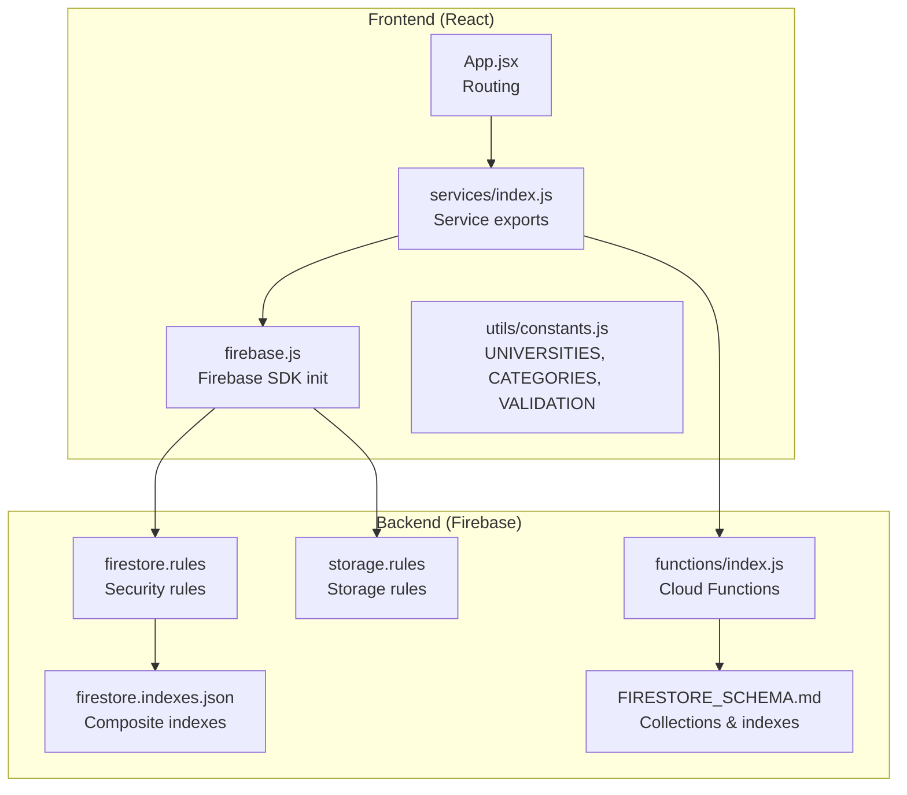
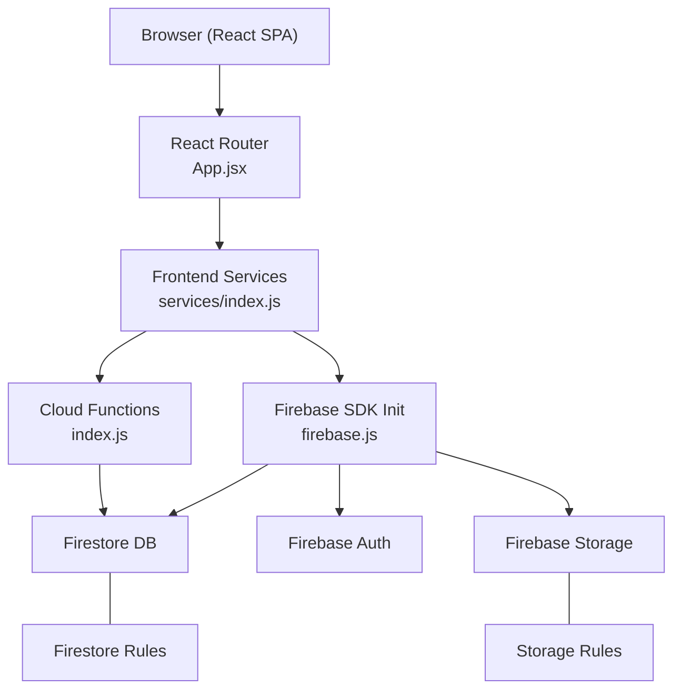
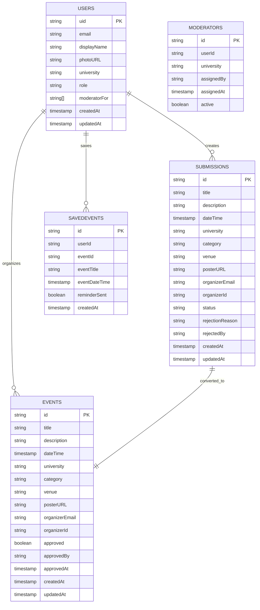
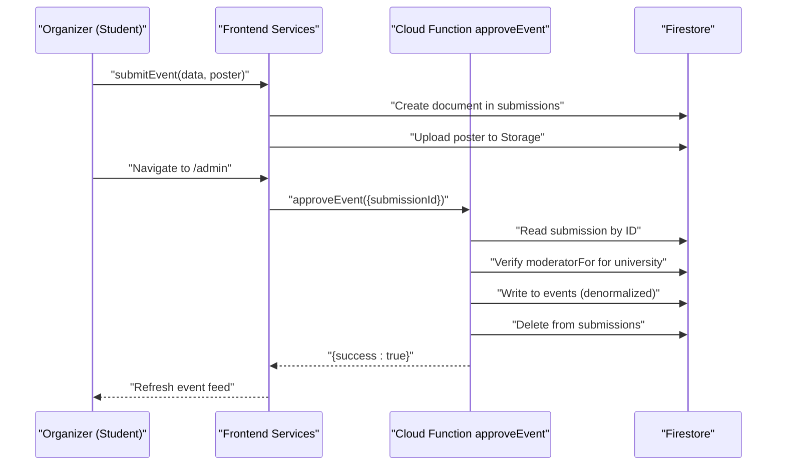
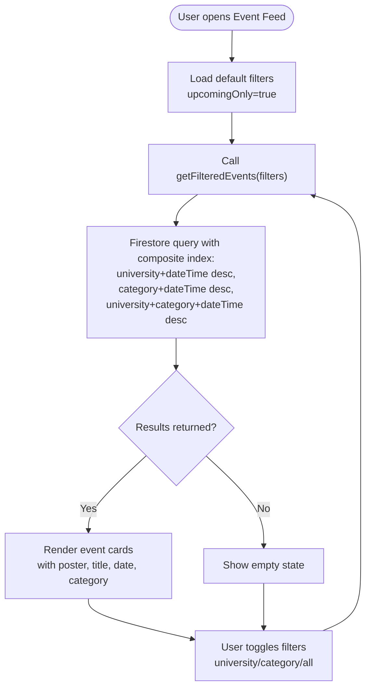
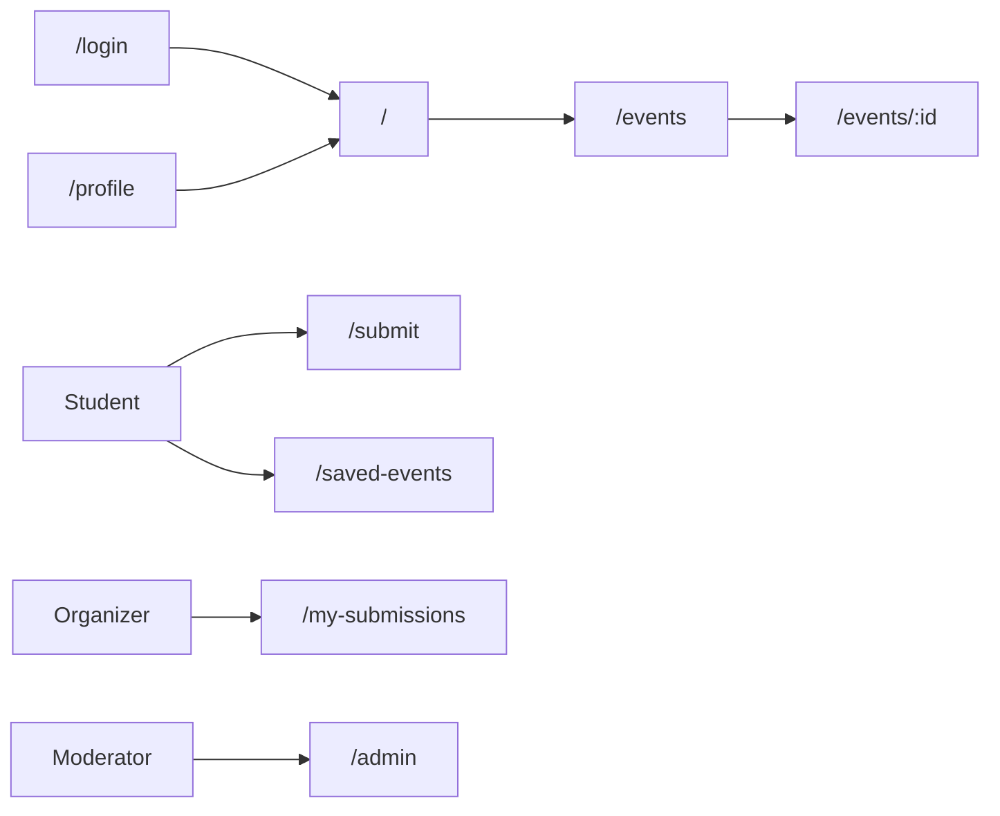
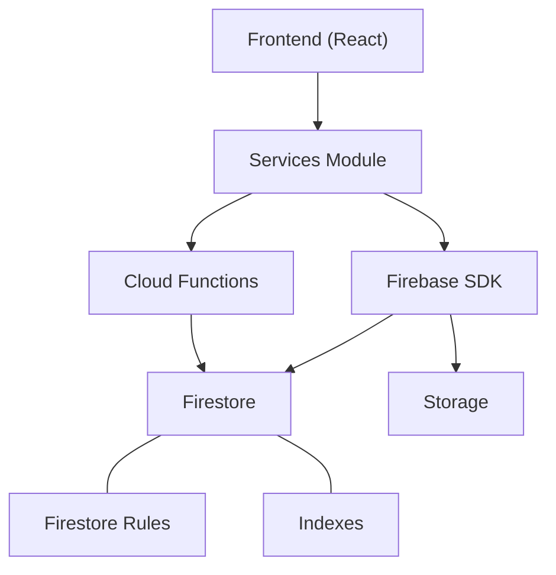

# Project Overview

<cite>
**Referenced Files in This Document**
- [README.md](file://README.md)
- [backend/README.md](file://backend/README.md)
- [QUICKSTART.md](file://QUICKSTART.md)
- [BUILD_SUMMARY.md](file://BUILD_SUMMARY.md)
- [frontend/SERVICES_USAGE.md](file://frontend/SERVICES_USAGE.md)
- [backend/FIRESTORE_SCHEMA.md](file://backend/FIRESTORE_SCHEMA.md)
- [backend/functions/index.js](file://backend/functions/index.js)
- [frontend/src/App.jsx](file://frontend/src/App.jsx)
- [frontend/src/firebase.js](file://frontend/src/firebase.js)
- [frontend/src/services/index.js](file://frontend/src/services/index.js)
- [frontend/src/utils/constants.js](file://frontend/src/utils/constants.js)
</cite>

## Table of Contents
1. [Introduction](#introduction)
2. [Project Structure](#project-structure)
3. [Core Components](#core-components)
4. [Architecture Overview](#architecture-overview)
5. [Detailed Component Analysis](#detailed-component-analysis)
6. [Dependency Analysis](#dependency-analysis)
7. [Performance Considerations](#performance-considerations)
8. [Troubleshooting Guide](#troubleshooting-guide)
9. [Conclusion](#conclusion)

## Introduction
Mela is a campus event discovery platform designed to unify event communication across Lahore’s academic institutions. It connects three primary user groups:
- Students: Discover, filter, search, and save events across universities.
- Event Organizers: Submit events for review and track submission status.
- Moderators: Review, approve/reject submissions, and manage events for assigned universities.

Mela centralizes event visibility, streamlines submission workflows, and maintains quality through role-based moderation powered by Firebase.

Practical value propositions:
- Students save time by discovering relevant events in one place, with filters by university, category, and date.
- Organizers reach a broader audience by submitting events that are vetted and published.
- Moderators efficiently manage submissions for their assigned universities with built-in approval workflows.

## Project Structure
The repository is organized into two main areas:
- frontend: React application with routing, services, UI components, and utilities.
- backend: Firebase configuration including Firestore collections, security rules, Cloud Functions, and deployment metadata.

**Diagram sources**
- [frontend/src/App.jsx:14-31](file://frontend/src/App.jsx#L14-L31)
- [frontend/src/services/index.js:1-7](file://frontend/src/services/index.js#L1-L7)
- [frontend/src/firebase.js:1-28](file://frontend/src/firebase.js#L1-L28)
- [frontend/src/utils/constants.js:1-100](file://frontend/src/utils/constants.js#L1-L100)
- [backend/functions/index.js:1-331](file://backend/functions/index.js#L1-L331)
- [backend/FIRESTORE_SCHEMA.md:1-250](file://backend/FIRESTORE_SCHEMA.md#L1-L250)

**Section sources**
- [README.md:48-76](file://README.md#L48-L76)
- [backend/README.md:6-18](file://backend/README.md#L6-L18)

## Core Components
- Frontend (React + Vite)
  - Routing via React Router with page components for landing, event feed, submission, moderation dashboard, profile, and saved events.
  - Services module exports for authentication, event retrieval, submissions, moderation actions, and user profile/saved events.
  - Firebase SDK initialized for Firestore, Auth, Storage, Functions, and Analytics.
  - Constants module defines supported universities, categories, statuses, roles, upload constraints, and helpers for validation and formatting.

- Backend (Firebase)
  - Firestore collections: users, events, submissions, savedEvents, optional moderators.
  - Cloud Functions: approveEvent, rejectEvent, checkModeratorStatus, createUserProfile, scheduled sendEventReminders and cleanupRejectedSubmissions.
  - Security rules and composite indexes for efficient querying and role-based access.
  - Storage rules for event poster uploads.

Key user role features:
- Students: browse, filter, search, save events; view details and posters.
- Organizers: submit events, track status, edit pending submissions, view rejection feedback.
- Moderators: review submissions for assigned universities, approve/reject with feedback, edit approved events.

**Section sources**
- [README.md:12-32](file://README.md#L12-L32)
- [README.md:125-150](file://README.md#L125-L150)
- [frontend/src/App.jsx:14-31](file://frontend/src/App.jsx#L14-L31)
- [frontend/src/services/index.js:1-7](file://frontend/src/services/index.js#L1-L7)
- [frontend/src/firebase.js:1-28](file://frontend/src/firebase.js#L1-L28)
- [frontend/src/utils/constants.js:1-100](file://frontend/src/utils/constants.js#L1-L100)
- [backend/FIRESTORE_SCHEMA.md:3-177](file://backend/FIRESTORE_SCHEMA.md#L3-L177)
- [backend/functions/index.js:47-120](file://backend/functions/index.js#L47-L120)
- [backend/functions/index.js:126-188](file://backend/functions/index.js#L126-L188)
- [backend/functions/index.js:194-225](file://backend/functions/index.js#L194-L225)
- [backend/functions/index.js:234-252](file://backend/functions/index.js#L234-L252)

## Architecture Overview
Mela follows a client-server architecture:
- Client: React SPA using Vite for development and Firebase Hosting for production.
- Serverless backend: Firebase Firestore for data, Firebase Authentication for identity, Firebase Storage for images, and Firebase Cloud Functions for business logic and scheduled tasks.

**Diagram sources**
- [frontend/src/App.jsx:14-31](file://frontend/src/App.jsx#L14-L31)
- [frontend/src/services/index.js:1-7](file://frontend/src/services/index.js#L1-L7)
- [frontend/src/firebase.js:1-28](file://frontend/src/firebase.js#L1-L28)
- [backend/functions/index.js:1-331](file://backend/functions/index.js#L1-L331)
- [backend/FIRESTORE_SCHEMA.md:181-250](file://backend/FIRESTORE_SCHEMA.md#L181-L250)

## Detailed Component Analysis

### Data Model and Collections
The Firestore schema defines five core collections with denormalized fields for performance and clear separation of concerns.

**Diagram sources**
- [backend/FIRESTORE_SCHEMA.md:3-177](file://backend/FIRESTORE_SCHEMA.md#L3-L177)

**Section sources**
- [backend/FIRESTORE_SCHEMA.md:3-177](file://backend/FIRESTORE_SCHEMA.md#L3-L177)

### Moderator Approval Workflow
This sequence illustrates the end-to-end flow for approving an event submission.

**Diagram sources**
- [frontend/SERVICES_USAGE.md:215-371](file://frontend/SERVICES_USAGE.md#L215-L371)
- [backend/functions/index.js:47-120](file://backend/functions/index.js#L47-L120)
- [backend/FIRESTORE_SCHEMA.md:224-241](file://backend/FIRESTORE_SCHEMA.md#L224-L241)

**Section sources**
- [README.md:195-239](file://README.md#L195-L239)
- [frontend/SERVICES_USAGE.md:215-371](file://frontend/SERVICES_USAGE.md#L215-L371)
- [backend/functions/index.js:47-120](file://backend/functions/index.js#L47-L120)

### Event Discovery and Filtering Logic
Filtering and search are handled client-side via service functions that query Firestore with composite indexes for performance.

**Diagram sources**
- [frontend/SERVICES_USAGE.md:102-211](file://frontend/SERVICES_USAGE.md#L102-L211)
- [backend/FIRESTORE_SCHEMA.md:181-196](file://backend/FIRESTORE_SCHEMA.md#L181-L196)

**Section sources**
- [frontend/SERVICES_USAGE.md:102-211](file://frontend/SERVICES_USAGE.md#L102-L211)
- [backend/FIRESTORE_SCHEMA.md:181-196](file://backend/FIRESTORE_SCHEMA.md#L181-L196)

### Frontend Routing and Navigation
The application routes define the user journeys for students, organizers, and moderators.

**Diagram sources**
- [frontend/src/App.jsx:14-31](file://frontend/src/App.jsx#L14-L31)

**Section sources**
- [frontend/src/App.jsx:14-31](file://frontend/src/App.jsx#L14-L31)

## Dependency Analysis
High-level dependencies:
- Frontend depends on Firebase SDK initialization and service modules for data access.
- Services depend on Cloud Functions for privileged operations (approve/reject) and Firestore for persistence.
- Backend relies on Firestore security rules and composite indexes for access control and query performance.
- Storage rules govern poster uploads.

**Diagram sources**
- [frontend/src/services/index.js:1-7](file://frontend/src/services/index.js#L1-L7)
- [frontend/src/firebase.js:1-28](file://frontend/src/firebase.js#L1-L28)
- [backend/functions/index.js:1-331](file://backend/functions/index.js#L1-L331)
- [backend/FIRESTORE_SCHEMA.md:181-196](file://backend/FIRESTORE_SCHEMA.md#L181-L196)

**Section sources**
- [frontend/src/services/index.js:1-7](file://frontend/src/services/index.js#L1-L7)
- [frontend/src/firebase.js:1-28](file://frontend/src/firebase.js#L1-L28)
- [backend/functions/index.js:1-331](file://backend/functions/index.js#L1-L331)
- [backend/FIRESTORE_SCHEMA.md:181-196](file://backend/FIRESTORE_SCHEMA.md#L181-L196)

## Performance Considerations
- Composite indexes configured for frequent queries (events by university+date, category+date, submissions by university+status, saved events by user+date).
- Denormalized fields in savedEvents reduce read operations when rendering user-specific lists.
- Scheduled cleanup of rejected submissions prevents index bloat and keeps the database lean.
- Image upload constraints (5MB, allowed types) improve reliability and reduce storage overhead.

[No sources needed since this section provides general guidance]

## Troubleshooting Guide
Common issues and resolutions:
- Permission denied errors: Ensure Firestore security rules are deployed and the user’s role is set correctly in the users collection.
- Functions not working: Check function logs via Firebase CLI and confirm the function is deployed and reachable.
- Image upload failures: Verify storage rules are deployed and the file meets size/type constraints.
- CORS errors: Confirm Firebase configuration is correct in the frontend and functions are deployed.

Verification checklist:
- Firebase project created and configured.
- Frontend Firebase config updated.
- Backend deployed (Firestore rules, indexes, Cloud Functions, Storage rules).
- User can sign up, submit events, and view submissions.
- Moderator can approve/reject and see updated events.
- Images upload and display correctly.
- No console or function errors.

**Section sources**
- [QUICKSTART.md:84-113](file://QUICKSTART.md#L84-L113)
- [backend/README.md:200-230](file://backend/README.md#L200-L230)
- [README.md:228-239](file://README.md#L228-L239)

## Conclusion
Mela delivers a streamlined, role-based event discovery and management platform tailored to Lahore’s academic ecosystem. Its architecture leverages Firebase for rapid iteration, clear security boundaries, and scalable serverless functions. The platform’s value lies in reducing fragmentation, improving discoverability, and enabling efficient moderation workflows—benefiting students, organizers, and moderators alike.

[No sources needed since this section summarizes without analyzing specific files]